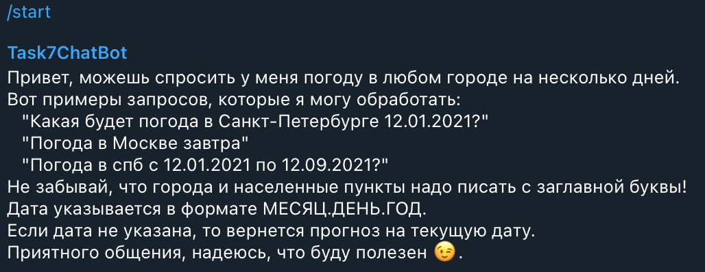
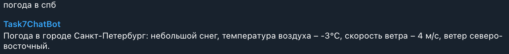
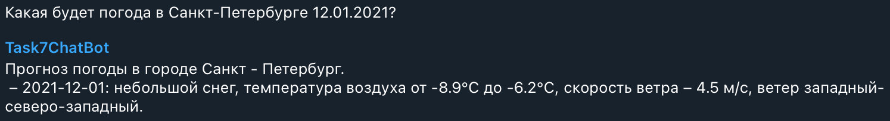
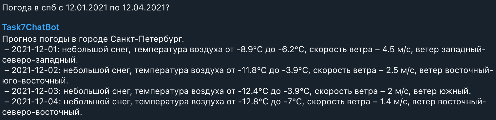

# Chat Bot

## Dependencies

```
pip install -r requirements.txt
```

Для работы бота необходимо создать файл `environment.env` 
и укзаать в нем `TELEBOT_TOKEN` и `WEATHER_API_KEY`.

## Usage

```
python main.py
```

## Examples
- Начало диалога

<p align="center">

</p>

- Приветсвие

<p align="center">

</p>

- Погода

<p align="center">

</p>

<p align="center">

</p>

<p align="center">

</p>

- Прощание

<p align="center">

</p>